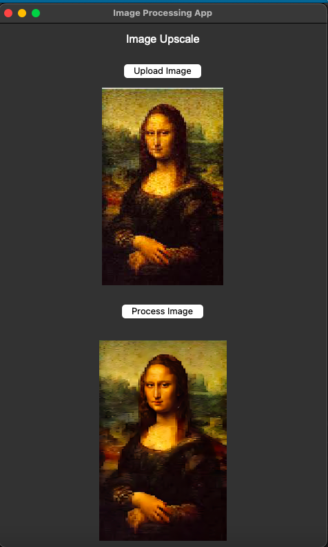

# Image Processing App with Replicate API and Tkinter



This repository hosts a Python-based GUI application that allows users to upscale and enhance images using the Replicate API and Tencent ARC's GFPGAN model. Built with Tkinter, it provides an intuitive interface for uploading, processing, and displaying images. 

### Features
- **Image Upload**: Select images from your local device via a file dialog.
- **Image Hosting**: Automatically upload the image to a hosting service and retrieve a public URL.
- **Image Processing**: Use the Replicate API to process the image with GFPGAN for upscaling and restoration.
- **Real-Time Feedback**: See a live preview of the uploaded and processed images within the app.
- **Error Handling**: Graceful error messages for common issues like upload failures or invalid API keys.

### Requirements
- Python 3.10 or later
- Required Python libraries:
  - `os`
  - `replicate`
  - `tkinter`
  - `Pillow`
  - `requests`
  - `python-dotenv`

### Setup
1. Clone this repository:
   ```bash
   git clone https://github.com/your-username/image-processing-app.git
   cd image-processing-app
   ```
2. Install dependencies:
   ```bash
   pip install -r requirements.txt
   ```
3. Create a `.env` file in the root directory and add your Replicate API token:
   ```
   REPLICATE_API_TOKEN=your_replicate_api_token
   ```
4. Replace the `imgbb` API key with your own in the `upload_image()` function.

### How to Use
1. Run the application:
   ```bash
   python app.py
   ```
2. Click **Upload Image** to select an image from your computer.
3. The image will be displayed, and an upload URL will be generated.
4. Click **Process Image** to enhance the image using the Replicate API.
5. View and save the processed image.
